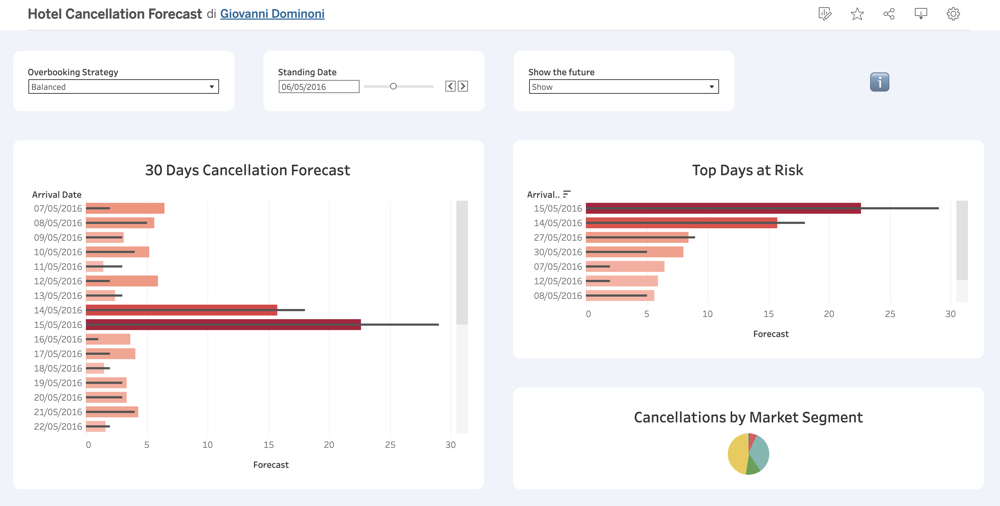

# 🏨 Dynamic Inventory Protection: Hotel Cancellation Forecasting

**An end-to-end data science pipeline that turns raw hotel booking data into a daily, risk-calibrated cancellation forecast — built to support real overbooking decisions, not just a leaderboard score.**

---

---

## Executive summary

Hotel rooms are perishable: a room empty tonight is revenue lost forever. The single biggest cause of empty rooms is cancellations — but not every booking is equally likely to cancel. This project builds a system that looks at every active reservation, every day, and estimates how likely it is to cancel — then translates that into **three ready-to-use business strategies** (Aggressive, Balanced, Cautious) that a Revenue Manager can pick from depending on how much risk they're willing to take when deciding how much extra capacity to sell.

The result is a single dataset, refreshed as if it were rebuilt every day over two years of real history, ready to be explored in an interactive Tableau dashboard.

---

## Table of Contents
- [The Business Problem](#the-business-problem)
- [The Solution](#the-solution)
- [Key Results](#key-results)
- [Pipeline Architecture](#pipeline-architecture)
- [Key Engineering Decisions](#key-engineering-decisions)
- [Known Limitations](#known-limitations)
- [Tech Stack](#tech-stack)
- [Repository Structure](#repository-structure)
- [How to Reproduce](#how-to-reproduce)
- [Dataset & Credits](#dataset--credits)
- [About the Author](#about-the-author)

---

## The Business Problem

Hotel revenue management depends on accurately forecasting cancellations to safely overbook and protect occupancy. In practice, generic machine learning approaches tend to break down once they leave the lab:

- **Temporal leakage:** models trained and tested on randomly shuffled data quietly "see the future," producing accuracy numbers that collapse the moment the model meets real, forward-only data.
- **Pricing anomalies:** raw booking data is full of small data-entry artifacts (e.g. a "Corporate" booking logged at $4/night) that can quietly corrupt what a model learns about price-driven behavior.
- **Arbitrary thresholds:** most tutorials stop at "the model says 62% cancellation probability," without ever asking what a Revenue Manager is supposed to *do* with that number. A single 50% cutoff ignores that the cost of wrongly walking a guest is very different from the cost of leaving a room empty.

## The Solution

This pipeline addresses all three problems directly:

1. **Cleans and standardizes** two years of historical booking data, resolving pricing anomalies through evidence-based imputation rather than simple deletion.
2. **Engineers domain-specific features** — including Portuguese public holidays and long-weekend "bridge" stays — to recover seasonal demand signal that the dataset itself doesn't fully capture (see [Known Limitations](#known-limitations)).
3. **Trains and validates models strictly on chronological splits**, so reported performance reflects how the model would actually behave once deployed — never on data it could have "peeked" at.
4. **Replaces the arbitrary 50% cutoff** with three calibrated, business-named decision thresholds — Aggressive, Balanced, Cautious — each tied to an explicit precision target rather than a statistical default.
5. **Simulates production, historically:** rather than a single train/test score, the pipeline replays a "time machine" simulation — reconstructing, for every day across the dataset's span, exactly which bookings were active and what the model would have predicted for them — producing the same kind of dataset a live system would generate.

## Key Results

| Metric | Value |
|---|---|
| Bookings analyzed | 119,390 (City Hotel + Resort Hotel, Portugal, Jul 2015 – Aug 2017) |
| Final model | `HistGradientBoostingClassifier` — selected after benchmarking against Random Forest across 6 scenario/hotel combinations |
| Resort Hotel — ROC-AUC | **0.92** |
| City Hotel — ROC-AUC | **0.87** |
| Production dashboard scope | **Resort Hotel only** — see [Known Limitations](#known-limitations) for why |
| Simulation coverage | 822 simulated days (2015-06-01 → 2017-08-31), 687,403 booking × day rows exported |
| Deployment strategies | Aggressive, Balanced, Cautious — each a separate, independently calibrated exposure score |

## Pipeline Architecture

The notebook is organized into 5 macro stages, each broken into numbered steps with its own rationale documented inline:

| Stage | What it covers |
|---|---|
| **1. Data Inspection** | Exploring raw data quality, anomalies, and category distributions |
| **2. Data Cleaning** | Date reconstruction, occupancy rules, cascading ADR imputation, nominal-rate reclassification |
| **3. Feature Engineering** | Portuguese holiday & bridge-stay features, final feature matrix encoding |
| **4. Model Validation** | Temporal split selection, leakage sanity-check, deposit-handling & model ablation study, business-driven threshold calibration |
| **5. Production Simulation & Export** | Daily time-machine simulation and Tableau-ready dataset export |

## Key Engineering Decisions

A few choices in this pipeline are deliberate, evidence-based trade-offs rather than defaults — documented here for anyone reviewing the code who wants the "why," not just the "what."

- **Non-Refundable bookings are not treated as real cancellation risk.** Since the hotel keeps the payment regardless of guest behavior, a "cancellation" on a Non-Refundable booking carries no revenue exposure. An ablation study (testing 3 ways of handling these bookings × 2 models × both hotels) confirmed that keeping them in training with the label overridden to "not canceled" — rather than dropping them entirely — gives the best result for both hotels.
- **Model choice was benchmarked, not assumed.** `HistGradientBoostingClassifier` outperformed `RandomForestClassifier` in every single one of 6 head-to-head comparisons before being locked in as the production model.
- **Thresholds were calibrated against business targets, not statistical defaults.** Balanced, Aggressive, and Cautious strategies each target an explicit minimum precision (75% / 66% / 90% respectively) rather than an arbitrary probability cutoff — and the Balanced threshold was further manually adjusted after live dashboard monitoring showed it sitting too close to the Aggressive tier in practice.
- **City Hotel is excluded from the final production export.** Its cancellation drivers proved harder to capture given the dataset's structural gaps (see below) — most visibly, its Cautious strategy could only reach ~2.6% recall at the required precision level, making it impractical to act on. The modeling work for City Hotel is kept in the notebook for transparency, but only Resort Hotel is shipped to the dashboard.

## Known Limitations

The dataset used here captures only a portion of each hotel's actual historical reservation volume for the period — it is not a complete, continuously-updated view of every booking on file. This has a real consequence: the model cannot observe **booking pace** (how quickly a given arrival date is filling up relative to prior cycles) or the **full seasonality curve**, both of which a live Revenue Management System would normally lean on heavily.

Engineering explicit Portuguese holiday and bridge-stay features (Stage 3) partially compensates for this — meaningfully so for Resort Hotel, whose demand is more holiday- and leisure-driven — but it was not enough to bring City Hotel's forecasting accuracy to a standard worth deploying.

## Tech Stack

- **Python** — pandas, NumPy for data cleaning and feature engineering
- **scikit-learn** — `HistGradientBoostingClassifier`, `RandomForestClassifier`, precision-recall threshold calibration
- **Matplotlib / Seaborn** — exploratory data analysis and diagnostics
- **`holidays`** — Portuguese public holiday and bridge-stay calendar generation
- **Tableau Public** — final dashboard layer
- **GitHub / Kaggle** — portfolio publication

## Repository Structure

```
├── clean_pipeline_v1_06.ipynb   # Full annotated pipeline: cleaning → modeling → export
├── hotel_bookings.csv           # Raw source dataset
├── bi_dashboard_v6.1.csv        # Final production export (Resort Hotel), Tableau-ready
├── bi_dashboard_v6.1.parquet    # Same export, Parquet format
└── README.md                    # This file
```

## How to Reproduce

1. Clone the repository and install dependencies: `pandas`, `numpy`, `scikit-learn`, `matplotlib`, `seaborn`, `holidays`, `pyarrow`.
2. Open `clean_pipeline_v1_06.ipynb` and run all cells top to bottom — each stage is self-contained and logs its own progress.
3. The final cell exports `bi_dashboard_v6.1.csv` / `.parquet`, ready to connect directly to Tableau (or any BI tool that reads a flat file).

## Dataset & Credits

This project uses the **Hotel Booking Demand** dataset, originally published by Nuno Antonio, Ana Almeida, and Luis Nunes (*Hotel booking demand datasets*, Data in Brief, 2019), distributed via Kaggle.

## About the Author

Built by **Giovanni Dominoni**, a former Revenue Manager (hotel and airline industries) transitioning into hybrid analytics roles — Analytics Translator, Business Analyst (Predictive Analytics), Solutions Consultant (Revenue Management Systems), and Product/Decision Science Analyst. This project reflects that dual perspective: every modeling decision here is grounded in an operational business question, not chosen for its own sake.
